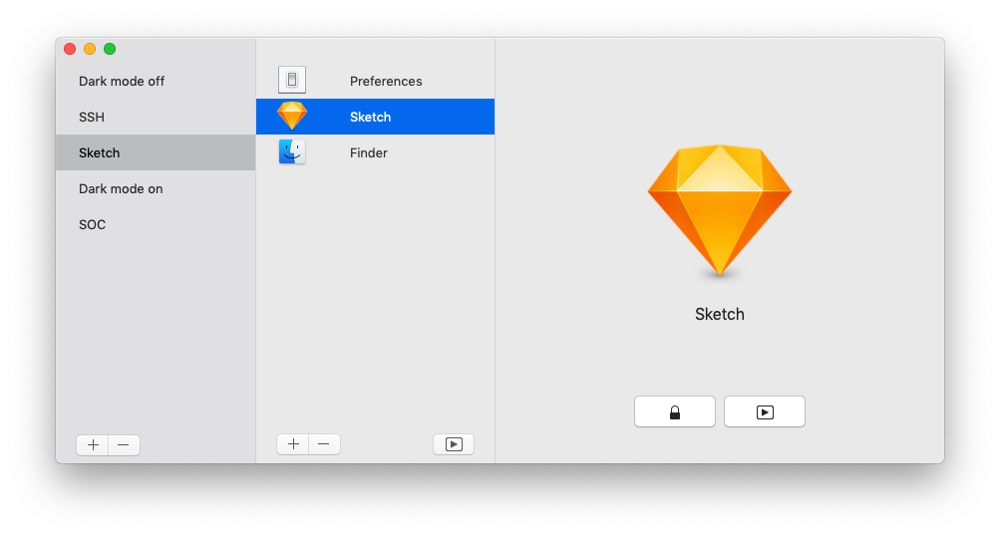
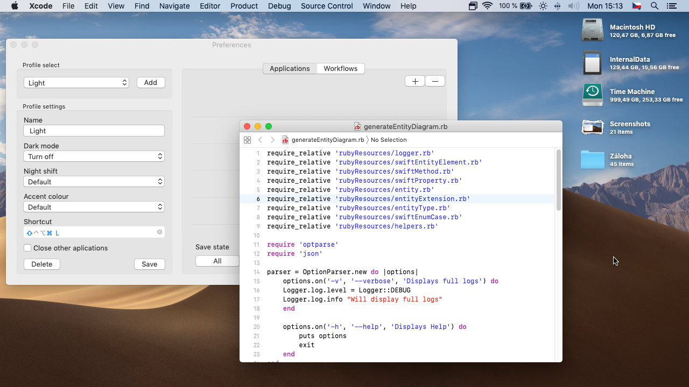
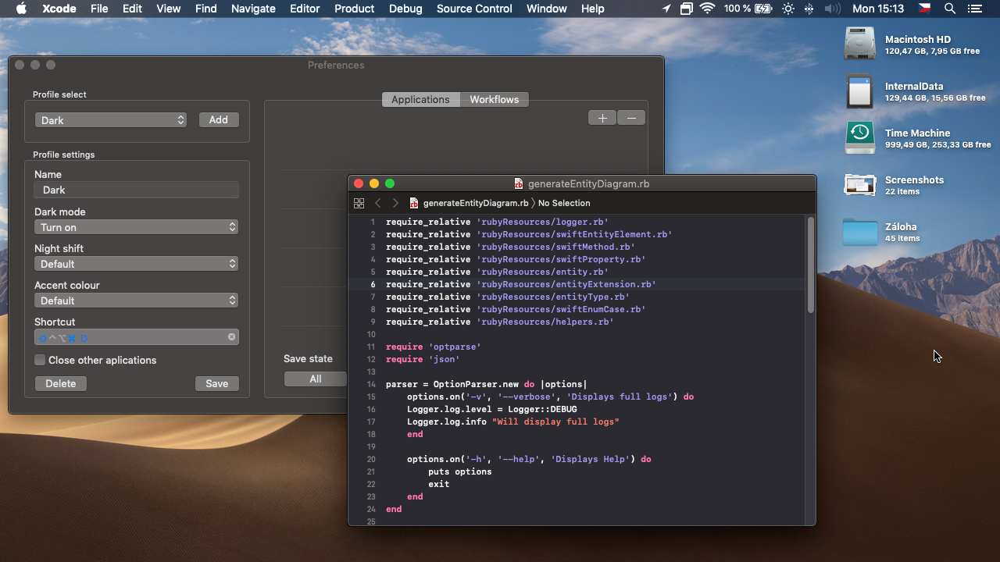
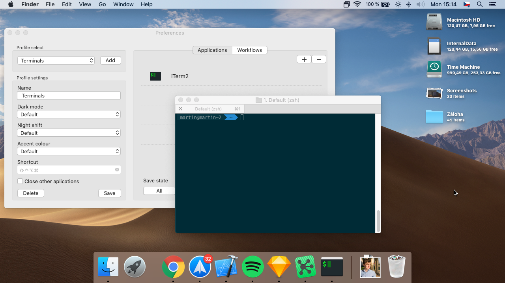
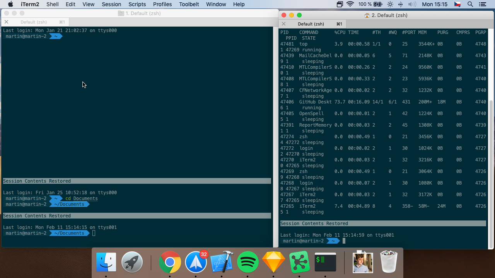
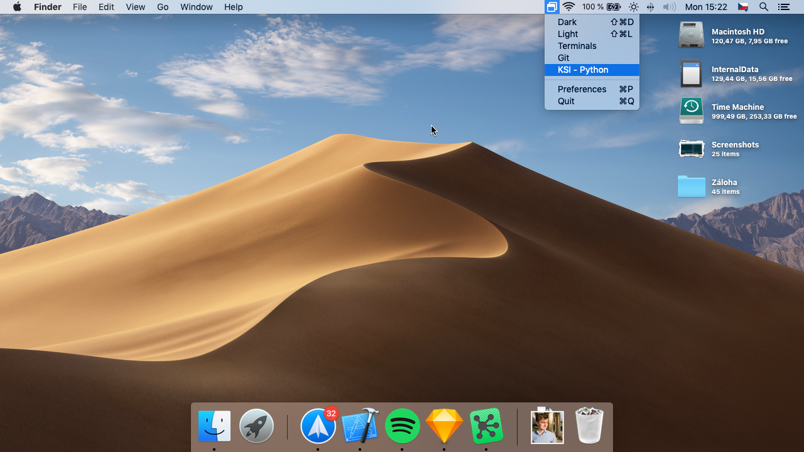
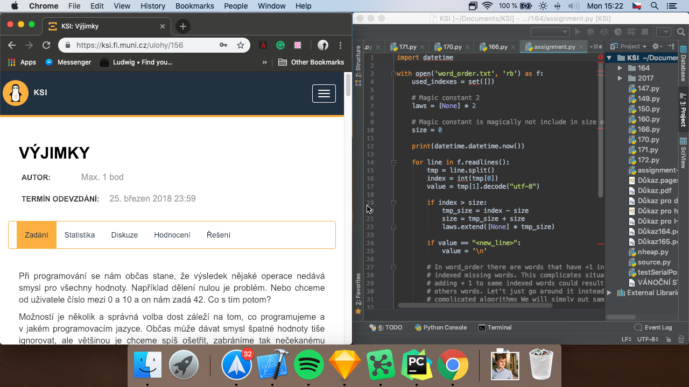

# Desktop Profiles &middot; 
The main purpose of this utility is to facilitate the transition among different workspaces (work environments). User-defined profiles are equipped with a container for caching apps internal states and its windows arrangement The profile also allows the user to predefine system settings e. g. theme, accent colour. Online demo is located [here](#demo).

When profile is invoked:
- Windows arrangement and internal state of selected apps are restored
- Settings for theme, accent colour, NightShift, are adjusted
- Other applications are either closed or kept open
- Assigned workflows are executed

➡️  [Download prebuild version](https://github.com/mamiksik/CabinetProX/releases) ⬅️

## SOČ
This app has been initially developed for science fare. (The paper regarding the development is available only in Czech).

➡️  [Read it here](doc_assets/soc.pdf) ⬅️

## Remote control proof of concept 
With further development the app could also be utilized in classrooms allowing teacher to switch student’s work environment remotely. The proof of concept is included in source code but if you wish to try it you would need to build the app yourself. 

## Demo

### Profile changing system settings 

||
|:---:|

|  |  |
|:---:|:---:|

>Profiles can be invoked by a keyboard shortcut.

### Profile restoring app internal state and app layout

||
|:---:|

|  |  |
|:---:|:---:|

>In these examples invoking profile restored app state and window arrangement

### Profile opening multiple apps at once

|  |  |
|:---:|:---:|
